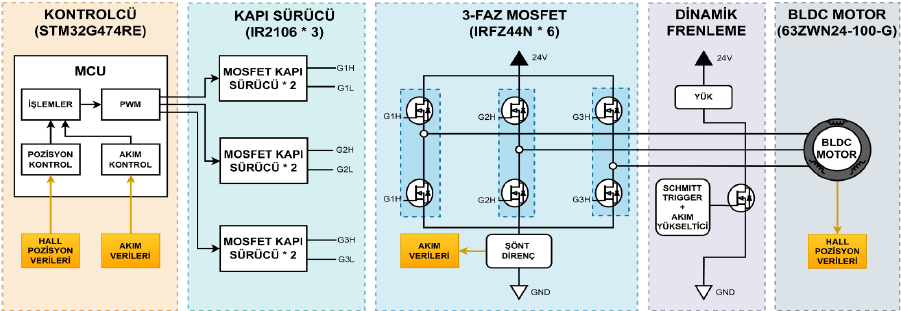
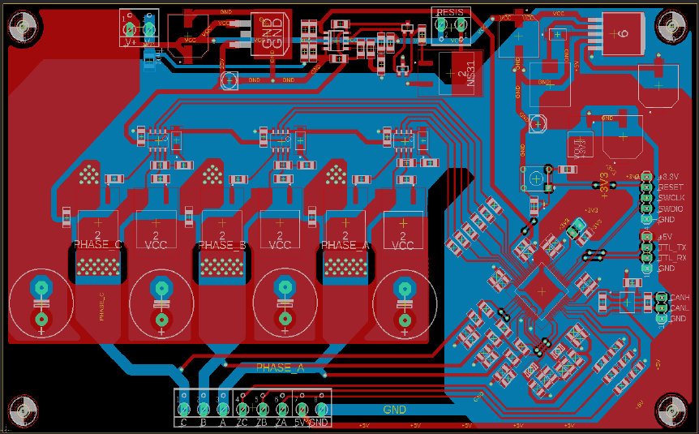
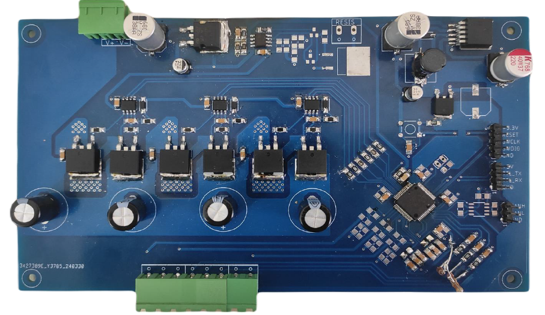

# BLDC Motor Driver
Closed-loop BLDC motor driver with PID speed control, ADC-DMA current sensing and 6-step commutation.

## Features
- PID-based speed control
- 6-step commutation
- Dynamic braking and safe-stop handling
- Shunt current sensing via ADC + DMA

## Hardware / Software
- STM32 HAL Libraries
- Custom PCB Design with EAGLE

## Notes
Project supported by TÜBİTAK 2209-B.

### Block Diagram

## Hardware

### PCB Layout

### Assembled PCB

